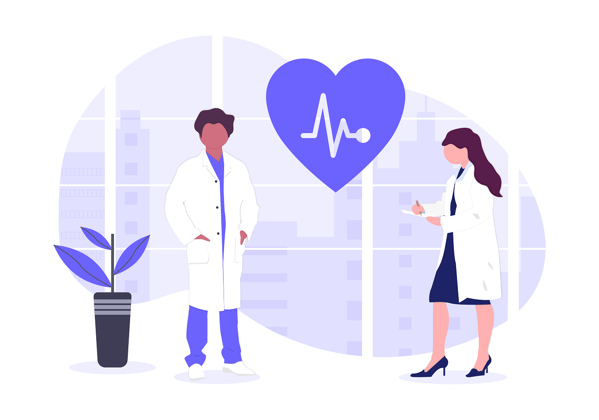

This fall marks the 20 year anniversary of going back to school and switching careers. Having been in the clinical laboratory (forensic pathology, medical technologist, then laboratory supervisor) for over 16 years, I made the decision to go into Information Technology. I enrolled in an adult continuing education curriculum at [University of Virginia](https://www.virginia.edu/). At the time, this was a new hybrid program of IT certification courses combined with traditional management classes at the university. After making it through the classes and passing the certification exams, I would be a Microsoft Certified Systems Engineer (Windows NT 4.0) and awarded a certificate in Information Systems Management from UVa. 

I was already working two jobs - full time laboratory and part-time managing the corporate web site and online presence. Now with these shiny new certificates in hand, I was ready to make the career change!  Still, it took another four years before I was completely full-time IT. The first position had many hats to wear - some system and database admin, maintaining web servers, web development, help desk management and whatever else needed to be done at the time.

It feels like another lifetime ago. Blogging was just starting to become popular. Facebook, Twitter and Instagram had not arrived on the scene yet.  The CEO of the healthcare system where I worked wasn't too interested in the new emerging online technology.  "You can't download a nurse," he was famous for saying at meetings. It was also the post dot-com bubble period. Maybe not a great time to switch careers? 

Looking back, it all worked out OK.  Other changes in healthcare drove new developments in IT. Legislation such as the "Health Information Technology for Economic and Clinical Health (HITECH) Act" and passage of the "American Reinvestment & Recovery Act" (ARRA) in 2009, are collectively known as [Meaningful Use](https://www.cdc.gov/ehrmeaningfuluse/introduction.html). These changes still generate more than enough work in Healthcare IT to keep me employed. But those are topics for another post.