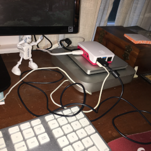

The \#DesktopPiChallenge is underway and going quite well so far. The Raspberry Pi 4 is replacing my 2013 Mac mini desktop for the next couple of weeks. 

Even while it was pulling down updates I was able to use Chromium to do some browsing. During the first couple of hours, the top of the case got a little warm to the touch, but not hot enough to be alarming.

Here's the setup:
* Raspbian Buster full image with apps dated 6/20/2019
* SanDisk Ultra microSDXC 64 GB - up to 80 MB/s
* SD Card imaged with [BalenaEtcher](https://www.balena.io/etcher/) v.1.5.51 
* Raspberry Pi 4 Model B - with 4 GB RAM
* Raspberry Pi 4 Case
* Raspberry Pi HDMI to HDMI micro cable
* Canakit USB-C Power Supply - 5.1 v 3.0 A
* Heatsinks placed on CPU, Memory and USB chips

Things that didn't go as expected:
* During boot up and configuration, connecting with 5 Ghz WiFi **failed**. I had to fall back to a 2.4 Ghz WiFi network.
* Once it was configured, attempting to check for Raspbian updates **failed**. This was anticipated since I had already seen @rasberrycoulis [post about this](https://twitter.com/raspberrycoulis/status/1148207955914952704?s=21) on Twitter. Trying again with "sudo apt-get update --allow-releaseinfo-change" fixed it.
* Procceding with "sudo apt-get upgrade --fix-missing" fixed another error about missing repositories.

After those small hickups, everything else went along smoothly. My remaining goals for this first evening were:
* Monitor CPU temps with RPi fully enclosed within case
* Use a Python program to collect temperature data to CSV file
* Push up to the cloud and [visualize the data](https://io.adafruit.com/dlittle55/dashboards/my-rpi4-dashboard) on AdafruitIO

Tommorrow I'll get the code posted up on GitHub. I want to try and get Visual Studio Code installed and see what software I can use to possibly do some live streaming. 