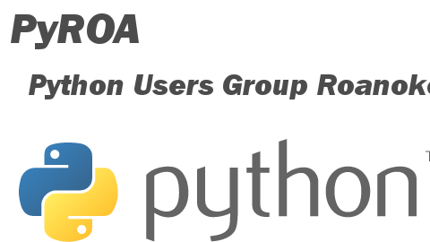

**Announcing a new Meetup!** A casual group for both new and experienced users of the Python programming language. Casual users, hobbyists and seasoned professionals are all welcome to join a friendly and helpful environment to discuss and ask questions.

Open Source projects, Python web development frameworks, Python on hardware (MicroPython), System Administration with Python, Data Science, Machine Learning/Artificial Intelligence with Python are all topics of interest to be explored with this group.

Check out the group and schedule on [Meetup.com](https://www.meetup.com/Python-Users-Group-Roanoke-PyROA/)

