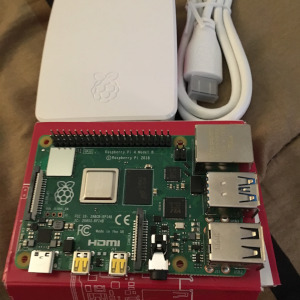

To be honest, it was a bit of a surprise hearing about the release of the Raspberry Pi 4 Model B. The last article that I had read pointed to 2020 as the earliest that a new model would be making an appearance.

Funny story - I was up doing some coding the night it was announced and just happened to see a Twitter post around 2:00 am Eastern Time. That would have been early morning in the UK, so my timing was perfect. I was able to order a kit very quickly after the big news was released. Of course overseas shipping took a few days, so I wasn't the first to get one, but still.  

As always, early adoption of a new tech device isn't without issue.  I've been reading about reports of overheating.  Also, I just saw first word about a possible [USB-C compatiblity issue](https://www.scorpia.co.uk/2019/06/28/pi4-not-working-with-some-chargers-or-why-you-need-two-cc-resistors/).  This will be my first time using USB-C for the power connector, so will see how things go. I [ordered mine from CanaKit](https://www.canakit.com/raspberry-pi-4-basic-kit.html) along with their power supply.  I've been buying Raspberry Pi boards and accessories from them for awhile now with no issues. So, I'm expecting things to work this time around.

This week I'll begin my \#DesktopPiChallenge - replacing my desktop Mac mini with the Raspberry Pi 4 for a couple of weeks. Details of the challenge and how it all works out will be posted here. 

