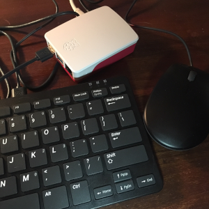

The Raspberry Pi 4 \#DesktopPiChallenge is going very well! For daily use, web browsing and email, it has proven to be more than adequate. I personally cannot tell any difference between browsing on the RPi4 and the Mac mini. Granted, neither are as fast as a system with a SSD, but that's like comparing apples to oranges.

Monitoring the [CPU temperatures](https://github.com/darrell24015/tempmon) has been an interesting experiment. For most activities, the temperatures stay between 65 and 70 degrees C. I did finally see the "high temperature" warning on the screen while compiling in MakeCode Arcade with the temps peaking at 79.4 C. That was while I was trying out the cool new [Adafruit PyBadge](https://www.adafruit.com/product/4200) - something I'll post about here later.

Originally, I was using the Mac keyboard with the RPi4. But I went ahead and purchased the official Raspberry Pi keyboard/hub and mouse. So now my rig is fully tricked out!

There are a few more things that I'd like to try:
* Monitor CPU temps **and** CPU usage together
* Install node.js and Gatsby to re-create the development environment on the RPi4
* Explore using [TensorFlow Lite](https://www.tensorflow.org/lite/guide/build_rpi)